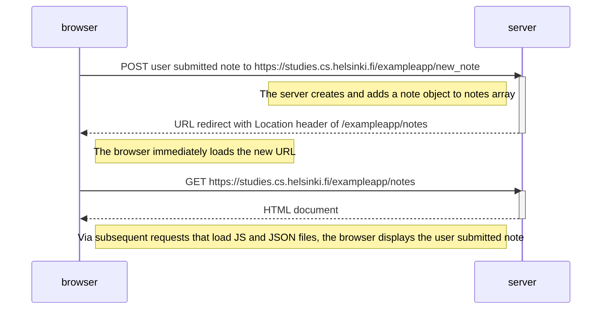

```mermaid
sequenceDiagram
    participant browser
    participant server

    browser->>server: POST user submitted note to https://studies.cs.helsinki.fi/exampleapp/new_note
    activate server
    Note left of server: The server creates and adds a note object to notes array
    server-->>browser: URL redirect with Location header of /exampleapp/notes
    deactivate server

    Note right of browser: The browser immediately loads the new URL


    browser->>server: GET https://studies.cs.helsinki.fi/exampleapp/notes
    activate server
    server-->>browser: HTML document 
    deactivate server

    Note right of browser: Via subsequent requests that load JS and JSON files, the browser displays the user submitted note 
```
