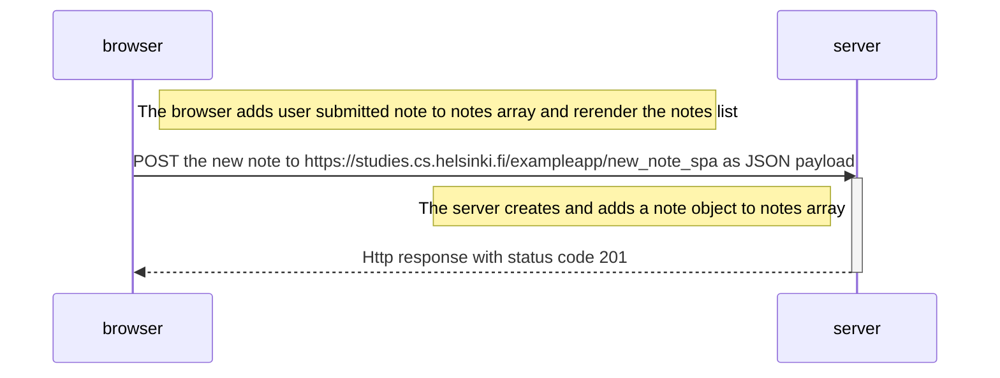

```mermaid
sequenceDiagram
    participant browser
    participant server

    Note right of browser: The browser adds user submitted note to notes array and rerender the notes list
    browser->>server: POST the new note to https://studies.cs.helsinki.fi/exampleapp/new_note_spa as JSON payload

    activate server
    Note left of server: The server creates and adds a note object to notes array
    server-->>browser: Http response with status code 201
    deactivate server
```